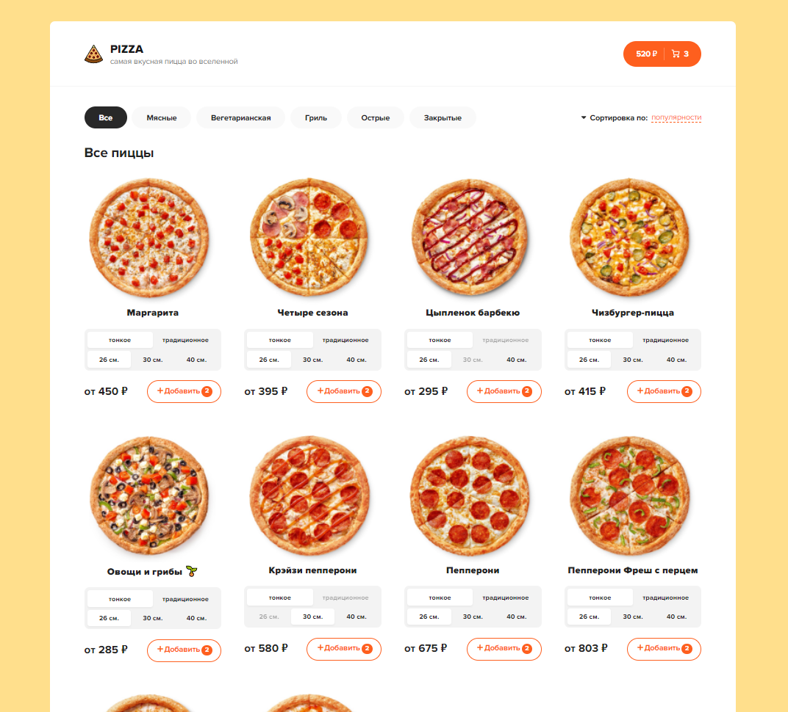

# Пиццерия

В данном проекте представлена верстка и реализация части функционала пиццерии.

## Цель проекта

1. Получение опыта работы с библиотекой React.
2. Получение опыта работы с Redux, Redux-thunk.
3. Получение опыта работы с библиотекой axios.
4. Получение опыта настройке роутов.

## Запуск проекта

### npm run server - запуск json-server
### npm start

## Функционал
- реализована фильтрация пиц

## Используемые технологии

- [HTML](https://developer.mozilla.org/ru/docs/Learn/Getting_started_with_the_web/HTML_basics) - язык разметки веб-страницы.
- [SCSS](https://sass-scss.ru/) - препроцессор CSS для описания внешнего вида HTML-документа
- [JS](https://developer.mozilla.org/ru/docs/Learn/JavaScript/First_steps/What_is_JavaScript) - язык программирования позволяющий создать динамичные веб-приложения.
- [React](https://ru.reactjs.org/docs/getting-started.html) - это JavaScript-библиотека для создания пользовательских интерфейсов.
- [React Router](https://v5.reactrouter.com/web/guides/quick-start) - это библиотека маршрутизации (routing) в React.
- [Redux](https://redux.js.org/) - это библиотека управления состоянием для приложений, написанных на JavaScript.

## Вид интерфейса

